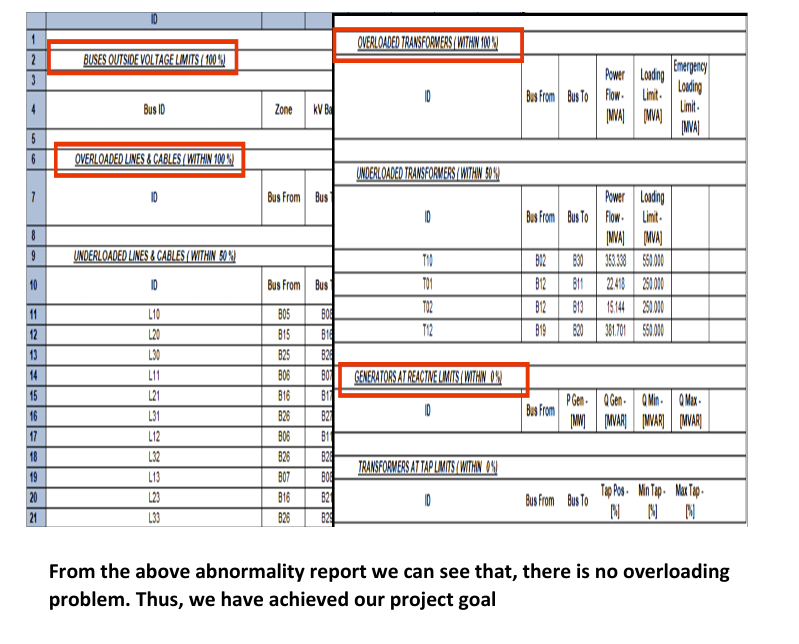
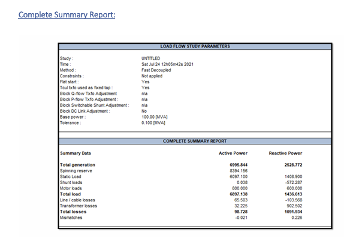

# Load-Flow-Analysis-of-IEEE-39-Bus-System

This project presents the **load flow analysis of the IEEE 39-bus power system**, also known as the **10-machine New England power system**. It was developed as a sessional course project for **EEE 306 – Power System Laboratory** at the **Bangladesh University of Engineering and Technology (BUET)**.

The study analyzes the base case system and then investigates the effects of integrating an **HVDC transmission line** and **large industrial induction motor loads**, followed by applying corrective measures to resolve system abnormalities.

###### **Key Features**

* **Base Case Load Flow Analysis:** Simulation using standard IEEE 39-bus benchmark data.

* **HVDC Integration:** Introduction of an HVDC link with tap-changing transformers.

* **Industrial Load Modeling:** Addition of large induction motor loads to represent industrial demand.

* **Abnormality Identification:** Detection of voltage violations, line overloads, transformer overloading, and generator reactive power limit violations.

* **Corrective Measures:** Use of SVCs, shunt capacitors, generation rescheduling, and line rating adjustments.

* **Practical Constraints:** No modification or removal of existing system equipment.

###### **System Overview**

* **Test System:** IEEE 39-Bus (10-Machine New England Power System)

* **Simulation Software:** CYMEPSAF

* **System Frequency:** 50 Hz

* **HVDC Components:**

    &nbsp; * HVDC line between inverter and rectifier buses

    &nbsp; * TCUL (Tap-Changing Under Load) transformers

* **Industrial Load:**

    &nbsp; * Ten induction motors (100 MVA each) connected at Bus 23

* **Reactive Power Compensation:**

    &nbsp; * Static VAR Compensator (SVC)

    &nbsp; * Shunt capacitor banks

###### **Simulation Results**

* Successful convergence of the base case load flow

* Voltage violations observed after HVDC and induction motor integration

* Generator reactive power limit violations due to high inductive demand

* Transformer and transmission line overloading under modified conditions

* Restoration of voltage, loading, and reactive power limits after corrective actions

###### **Project Impact**

This project demonstrates practical challenges in **large-scale power systems** when integrating **HVDC transmission** and **heavy industrial inductive loads**. It provides hands-on experience in identifying system abnormalities and applying effective corrective solutions while maintaining realistic operating constraints.

###### **Project Status**

✅ Completed — Functional load flow simulation verified and all major abnormalities resolved

🔧 Future Scope: Dynamic stability analysis, FACTS-based optimization, and real-time control strategies

###### **Contributors**

Sanath Kumar Das (1706149)

Md. Rokonujjaman (1706150)

Md. Tajbid Zaman Rhythm (1706152)

**Joy Saha (1706189)**

Department of Electrical \& Electronic Engineering

Bangladesh University of Engineering and Technology (BUET)

###### **License**

This project is for academic and educational purposes only.

